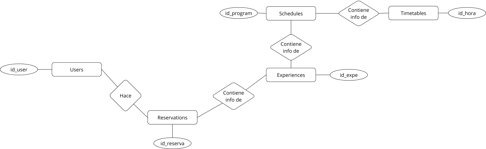
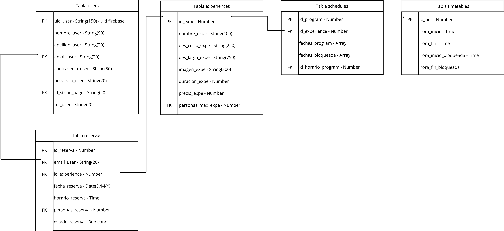

# PROYECTO PERSONAL BOOTCAMP FULL STACK DEVELOPER OCT-25

## DESCRIPCIÓN DEL PROYECTO
Backend (server) del proyecto personal para el Bootcamp Full Stack Vitoria (oct-25). 
Este proyecto está construido con Node.js + Express, utilizando PostgreSQL para la gestión de la base de datos.

## TECONOLOGÍAS UTILIZADAS
- Node.js + Express
- PostgreSQL - PG
- Multer
- CORS
- Cookie-parser
- Dotenv
- Express-validator
- Bcrypt
- Swagger

## INSTALACIÓN Y EJECUCIÓN EN ENTORNO LOCAL
1. Forkear este repositorio https://github.com/Albasan08/proyecto-personal-bfs_server
2. Instalar dependencias
```bash
npm i install 
```
3. Renombrar el archivo .env.template como .env y asignar las variables de entorno
4. Ejecutar servidor
```bash
npm run dev
```
5. Leer el archivo init.sql para insertar las queries iniciales en una nueva BBDD en PostgreSQL

## ESTRUCTURA DEL PROYECTO
```bash
public/
    uploads/
        experiencias/
src/
    config/
        dbConnect.js
    controllers/
        admin.controllers.js
        auth.controllers.js
        program.controllers.js
        public.controllers.js
        user.controllers.js
    db/
        queries.js
    middlewares/
        admin/
            deleteImage.js
            imagenMulter.js
            uploadlImage.js
        auth/
            validarToken.js
            verificarRol.js
        validarCampos.js
    routes/
        admin.route.js
        auth.route.js
        program.route.js
        public.route.js
        user.route.js
    validators/
        admin.validator.js
        program.validator.js
    app.js
init.sql
```
## ENDPOINTS PRINCIPALES
1. Públicos
```bash
/experiencias/
```
2. User
```bash
/user/
/experiencias/
```
3. Admin
```bash
/admin/
```
4. Program
```bash
/gestor
```

## ROLES DE USUARIO
Se diferencian tres roles de usuario: 
- **Admin:** Rol que gestiona la información de las experiencias
- **Program:** Rol que gestiona la programación de cada experiencia
- **User:**Rol cliente normal

## BASE DE DATOS
La BBDD relacional está gestionada a través de PostgreSQL.
### Tablas principales
- Users
- Experiences
- Reservations
- Schedules
- Timetables

### Modelo relacional


### Modelo lógico
